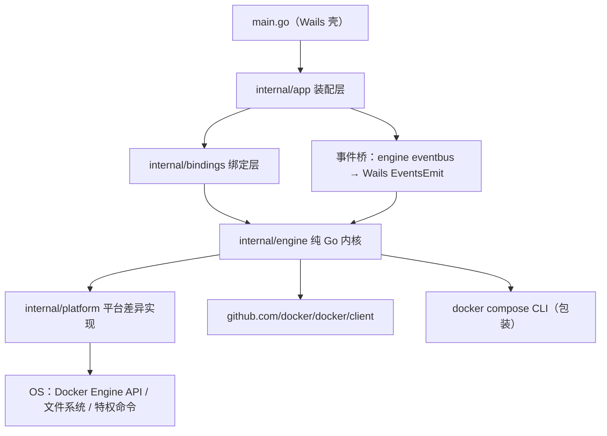

# phpbox Desktop · 最终设计方案

- **状态**：Approved（开工依据）
- **日期**：2026-09-13
- **文档地位**：桌面项目的唯一权威蓝图。历史决策过程见附录文档（§11）；本文与其冲突时，以本文为准并回写修订记录。
- **关联文档**：Annex A = `docs/adr-001-desktop-tech-stack.md`（技术栈决策记录，含 Amendment 1/2）；Annex B = `docs/desktop-ui-spec-v2.md`（UI 交互规格 v2.1，含裁决日志）。本文建立后随 phpbox-desktop 仓库建立一并迁入。

---

## 1. 项目定位

**一句话**：把 phpbox（纯 Bash 的本地 Docker 多版本开发环境管理器：PHP/MySQL/PostgreSQL/Redis/Nginx/Go + 站点 + 离线缓存 + 备份）升级为跨平台桌面应用，bash CLI 保留为高级用户入口与过渡期引擎。

**用户时刻模型**（所有 UI 与引擎设计的锚点）：

| 时刻 | 频率 | 代表动作 |
| --- | --- | --- |
| A 日常巡检 | 每天多次 | 看服务健康、取连接信息、看日志 |
| B 环境变更 | 每周 | 装版本/扩展/站点、版本试水切换 |
| C 运维处置 | 偶发但紧急 | 故障诊断、磁盘治理、备份迁移 |

**非目标**：生产部署/高可用；多机远程编排（v2 前不做）；容器运行时替代品；修改用户项目源码。

**差异化卖点（必须被 UI 显性化）**：离线缓存（`offline/` 命中即零网络安装）、真实踩坑经验产品化（已知故障模式一键修复）、多版本并行 + 秒切。

---

## 2. 技术栈（定案，详见 Annex A）

| 决策项 | 定案 | 状态与备注 |
| --- | --- | --- |
| 引擎语言 | **Go 1.27.x（当前最新稳定版，2026-08 发布）**；策略=跟随最新稳定版，CI 矩阵含最新版+次新版 | 定案；注意 1.27 要求 macOS 13+；泛型方法已获语言级支持（§5.3） |
| Docker 通信 | **Engine API（官方 SDK + `WithAPIVersionNegotiation`）**；`docker compose` / `save` / `load` 包装 CLI | 定案 |
| 桌面壳 | **Wails v2.10+（当前）**；v3（beta，官方 2026-08-02 公告"桌面 API 已稳定"）在评估窗口复评 | 动态决策，触发器见 ADR §6 |
| 前端 | Vue 3 + TypeScript + Vite + Naive UI + Pinia | 定案 |
| 特权操作 | 平台分支助手（Linux pkexec / macOS osascript / Windows RunAs） | 定案 |
| 引擎纪律 | **`internal/engine/` 不 import 任何 UI/框架包**（宪法条款，CI 强制） | 定案，ADR 评为主最有价值决策 |

---

## 3. 系统架构

### 3.1 分层与依赖方向



### 3.2 通信模型

- **请求/响应**：前端 → Wails 绑定（进程内函数调用，无 HTTP 层）→ engine 方法。
- **推送**：engine `eventbus` → app 事件桥 → Wails EventsEmit → Pinia/composables。承载：任务阶段、流式日志、健康变化。
- **阶段 0 形态**：engine 未 Go 化的模块由 bindings 层 spawn bash `phpbox` CLI，**以日志行推断九态**（解析规则 = bindings 层可配置映射表，标记集契约冻结：`[INFO]/[OK]/[ERR]/[WARN]` + 阶段关键词）；推断失败降级显示原始日志，不臆造状态。

### 3.3 依赖规则（CI 强制，`make purity`）

1. `internal/engine/**` 出现 `wails` import 即失败（`go list -deps` 检查）。
2. 平台差异只允许存在于 `internal/platform`（engine 面向接口）。
3. 前端只允许 `src/api/` 触摸 wailsjs 生成绑定。
4. 服务线之间禁止互相 import；跨线联动在 registry 显式注册回调。
5. 生成物（wailsjs/models.ts）为类型源头，手写 TS 只补 UI 派生字段。

---

## 4. 目录结构（权威版）

```
phpbox-desktop/
├── main.go                        # Wails 入口：窗口 + Bind 注册（唯一直接 wails.Run 处）
├── wails.json
├── go.mod                         # module github.com/xiaokentrl/phpbox-desktop
├── Makefile                       # dev / build / parity / lint / purity / ci
│                                   #（工具依赖用 go.mod 的 go tool 指令管理，Go 1.24+）
├── internal/
│   ├── pkg/                       # 跨包共享内核（晋升制：第二个包需要时才迁入，禁 utils 垃圾场）
│   │   ├── execx/                 #   泛型执行助手：RunJSON[T] / MapConcurrent[In,Out] / RunStream
│   ├── app/                       # 装配层：接口→实现接线、事件桥
│   ├── bindings/                  # Wails 绑定（薄适配 + CLI spawn 桥 + 命令透明化元数据）
│   │   ├── services.go  sites.go  backup.go  offline.go  system.go
│   ├── engine/                    # ★ 纯 Go 内核
│   │   ├── docker/                #   Engine API 客户端 + fakes.go（接口化替身）
│   │   ├── compose/               #   docker compose 包装（统一超时/stderr 采集）
│   │   ├── transaction/           #   九态状态机 + 回滚快照
│   │   ├── envfile/               #   .env 读写（值含 = 不截断）
│   │   ├── paths/                 #   容器/卷/键名派生 + 版本校验
│   │   ├── portalloc/             #   端口占用与空闲分配
│   │   ├── eventbus/              #   进程内事件总线
│   │   ├── health/                #   站点健康 HEAD 探测（Go 侧，规避 WebView CORS）
│   │   ├── services/              #   Service 接口 + 通用编排 + registry
│   │   │   ├── mysql/  pgsql/  redis/  nginx/  php/（build+extensions）  gosvc/
│   │   ├── offline/               #   imagetx（三段决策）+ phptx（APK/PECL 事务）
│   │   ├── backup/                #   容器化 dbdata 打包 / -m 解包 / busybox 规避全保留
│   │   └── sites/                 #   vhost 生成/校验/回滚 + hosts 内容计算
│   └── platform/
│       ├── hosts/（linux/darwin/windows）  paths/  elevate/
├── cmd/phpboxd/                   # 引擎 CLI（parity 对拍 + 高级用户入口 + 未来 server 挂载点）
├── frontend/                      # Vue3+TS+Vite+Naive UI+Pinia
│   ├── wailsjs/（生成物勿改）      └── src/{api,stores,composables,views,components,types,router}
├── build/                         # 图标 / manifest / plist
├── test/parity/                   # bash phpbox ↔ phpboxd 对拍
├── scripts/                       # gen-mocks / check-engine-purity / release
├── .github/workflows/             # ci.yml（三平台矩阵 + purity）+ parity.yml
├── docs/                          # architecture / migration 状态表 / ui-spec（自本仓迁入）
└── AGENTS.md
```

---

## 5. 核心接口与数据模型

### 5.1 服务线接口（消解 bash `_generic_service_install` 的五处 case 分支）

```go
type Service interface {
    Name() string
    Versions(ctx context.Context) ([]string, error)
    Install(ctx context.Context, opts InstallOpts) error    // opts: 版本/端口/密码/扩展集
    Uninstall(ctx context.Context, opts UninstallOpts) error // opts: Purge bool
    Instances(ctx context.Context) ([]Instance, error)
    SetPort(ctx context.Context, ver, port string) error
    DefaultPort() int
    EnsureImage(ctx context.Context, ver string, mode ImageMode) error // ImageMode: Auto|Preload
}
```

通用编排（版本守门 → 回滚快照 → 端口/密码 → 配置生成 → 启动健康检查 → 提交/回滚）在 `services/service.go` 单点实现；各线只提供差异（镜像 tag 规则、compose 模板、健康检查命令、默认端口常量）。

### 5.2 事务状态机（bash 注释契约 → 代码契约）

```text
absent → preparing → configured → starting → healthy → committed
                                        └→ failed → rolling_back → rolled_back
```

非法迁移在运行期拒绝并记录；快照语义与 bash 回滚一致（只清本次新增，先快照存在性，绝不碰既有状态）。

### 5.3 泛型使用规范（Go 1.27：泛型方法已获语言级支持）

**语言事实**（go.dev 官方）：方法可声明自己的类型参数——`func (r *Rand) N[Int intType](n Int) Int`（math/rand/v2 实例）；两条硬限制：**接口方法不能声明类型参数**、**泛型方法不能用于实现接口方法**。

由此推导的分层规则（宪法级约束）：

| 层 | 泛型用法 | 理由 |
| --- | --- | --- |
| **抽象层（接口）** | **禁止**。Service / DockerClient / EventBus 接口保持非泛型 | 泛型方法无法满足接口方法——接口带泛型会让 fakes/mock 体系失效 |
| **具体实现层** | 允许泛型方法：typed 事件包装器 `bridge.On[TaskPhase](fn)`、registry 类型化取用 `registry.Lookup[T Service](name)` | 直接调用方获得编译期类型安全，消除类型断言 |
| **共享助手** | 泛型函数：`execx.RunJSON[T]`（compose/CLI 输出解析）、`execx.MapConcurrent[In,Out]`（并行健康巡检，errgroup） | 类型安全 + 消除样板 |
| **反模式（禁止）** | Result/Optional 单子、泛型 Repository、Service 接口泛型化、为泛型而泛型的容器 | 非惯用；抽象靠接口不靠类型参数 |
| **优先顺序** | 先用标准库泛型（slices/maps 1.21+、range-over-func 1.23+）再自写 | 官方实现覆盖 90% 需求 |

### 5.4 公共函数定义规则（承袭 bash"公共逻辑单点实现"纪律）

1. **stdlib first**：slices/maps/min/max 已覆盖的禁止手写。
2. **晋升制**：助手先住第一个需要它的包；**第二个包需要时才晋升** internal/pkg/（首批：execx），禁止预放。
3. **禁 utils 垃圾场**：共享包按领域命名（execx/strs/version），不做万能 utils。
4. **移植出处保留**：自 bash 移植的函数保留"移植自 lib/xxx.sh"注释，作 parity 锚点。
5. **失败语义**：可能阻塞/失败的助手必须带超时与错误返回。

### 5.5 其余要点

- `eventbus`：主题化事件（task.phase / task.log / health.changed / disk.warning），app 桥接后前端按订阅消费。
- `docker.Client` 接口化 + `fakes.go`：bash 时代假 docker 的状态记忆语义（load 后镜像才存在）成为引擎自带测试设施。
- 已知故障模式库（诊断面板数据源，六模式）：sock crash loop / nginx 属主异常 / 端口占用 / PHP 异常 502 / 镜像缺失 / 闭包漂移——每模式含检测条件、一键修复、CLI 兜底。
- 前端 TS 类型（`EngineState` 九态、`ServiceInstance`、`SiteEntry`、`TaskState`）见 Annex B §6.5。

---

## 6. UI 设计总纲（详规见 Annex B）

- **IA**：站点（默认首屏）· PHP · MySQL · PostgreSQL · Redis · Nginx · Go · 备份恢复 · 离线缓存 · 设置 · 总览（兜底）。全局设施：Onboarding、任务中心（单队列 + 陈旧锁恢复）、通知中心、命令面板。
- **九条核心流程**：Onboarding / 安装向导（离线命中徽章 + 回滚报告）/ 建站（特权助手）/ 版本切换（乐观+回滚）/ 扩展变更（五步+预设档案）/ 日常启停 / 故障排查（症状树+修复树）/ 备份迁移 / 卸载（两段式）。
- **交互要点**：命令透明化（每操作展示等价 CLI）、乐观/确认语义表、复制规范（密码 8s 掩码）、空状态四要素、静动分离刷新策略、任务抽屉全局挂载。
- **全局态**：四态页面模型 + 最小窗口 1024×680 + 导航图标收缩。

---

## 7. bash → Go 资产移植映射

| bash 现状 | Go 归宿 | 移植要点 |
| --- | --- | --- |
| bin/phpbox 加载链 | internal/app 组合根 | 隐式顺序 → 显式构造注入 |
| lib/common/install.sh 事务 | engine/transaction | 状态机类型化，非法迁移拒绝 |
| _generic_service_install | services/service.go | 接口编排（回调化目标形态） |
| 各线 common/*.sh | services/<线>/ | 默认端口常量、属主治愈、sock 清理经验逐条搬 |
| _ensure_offline_image | offline/imagetx | 三段决策 + preload 转正 |
| PHP 构建管线（build/offline/apk-fetch） | services/php/build + engine/offline/phptx | 暂存→验证→原子晋升契约不变 |
| 假 docker 测试替身 | engine/docker/fakes.go | 状态记忆语义成为引擎测试设施 |
| lib/backup（容器打包/-m/busybox） | engine/backup | 三项修复语义原样保留 |
| tests/ 七闸门 | test/parity + Go 单测 | bash 引擎继续跑七闸门；Go 对拍同场景 |
| error() 统一退出 | error 分类（哨兵/自定义类型） | 错误分类契约在 Go 侧实现 |

**移植状态表**在 phpbox-desktop `docs/migration.md` 逐包打勾跟踪。

---

## 8. 测试与质量策略

1. **Go 单测**：包内 `*_test.go`，外部依赖全部接口化（docker/compose/exec），fakes 承载 bash 时代语义。
2. **引擎集成测**：真 Docker，环境缺失显式 `SKIPPED`。
3. **Parity 对拍**：`test/parity`——同一操作分别经 bash phpbox 与 phpboxd 执行，断言产物一致（yml/.env/容器状态/离线库）。阶段 1 每移植一个包，对应 parity 用例转绿。
4. **Purity CI**：规则 3.3-1 的机械检查 + `go vet` + 三平台构建矩阵。
5. **bash 侧七闸门继续运行**：bash 引擎在过渡期仍是产品，闸门不退役。
6. **前端**：vitest 组件测 + 类型检查；wailsjs 生成物新鲜度检查。

---

## 9. 路线图与里程碑验收

| 阶段 | 交付 | 引擎形态 | 平台 | 验收标准 |
| --- | --- | --- | --- | --- |
| **阶段 0**（M0→M0.5） | Wails v2 骨架 + docker POC（列容器+健康）→ v0.1 MVP（Onboarding/总览/安装向导/实例详情+连接抽屉/站点列表/任务抽屉/设置基础/i18n 脚手架） | bash spawn + 日志推断 | Linux/macOS | MVP 全流程（装 PHP→建站→hosts→浏览器可访问）零终端操作；七闸门 + purity 绿 |
| **阶段 0.5** | 壳层评估窗口 | —— | —— | 依 ADR 触发器 5/6 复评 v3：GA/后期 beta → v1.0 直接用 v3；否则 v2 继续 |
| **阶段 1**（M1→M1.5） | Go 引擎热路径（services 通用编排 + mysql/redis/nginx + 事务框架）→ v1.0（备份恢复/扩展增删/Go 线/通知中心/命令面板） | Go 引擎逐包替换，parity 逐包转绿 | + Windows 原生（named pipe） | parity 全绿；Windows 全流程实测；离线命中徽章端到端 |
| **阶段 2**（M2） | 离线缓存管理页（verify/prune/preload）· 诊断面板一键修复 · 站点健康探测 · PHP 线移植 · i18n 发布 | Go 引擎全量 | 三平台 | 断网重装全流程实测；六模式诊断实测 |
| **阶段 3**（M3） | 托盘 · 嵌入式终端 · 多机 | server 模式可选（Gin 挂 phpboxd） | 三平台 | Wails v3 迁移完成（若触发） |

---

## 10. 风险登记册

| # | 风险 | 缓解 | 状态 |
| --- | --- | --- | --- |
| R1 | Wails v3 时点不确定 | ADR 触发器 5/6（评估窗口+检查点）；引擎零依赖使迁移有界 | 监控中 |
| R2 | bash 日志推断脆弱 | 标记集契约冻结 + 可配置映射表 + 降级策略 | 已缓解 |
| R3 | 数据 uid 属主 | 容器 root 打包/解包（已真机验证 999/70） | 已解决 |
| R4 | Windows named pipe 边缘场景 | 阶段 1 实测清单（连接/提权/路径） | 待验证 |
| R5 | offline 库无根因清空复发 | 离线缓存页 verify + 阈值通知（<§10 引擎待实现） | 部分缓解 |
| R6 | 单人 bus factor | AGENTS/docs 全套 + parity 使引擎可被第三方接手 | 持续 |
| R7 | parity 漂移（两引擎行为分叉） | CI 强制对拍；移植包"转绿才删 bash 路径" | 制度性 |
| R8 | busybox/overlayfs 类容器环境陷阱 | bash 时代修复清单随移植逐条搬运，不得"重写时优化掉" | 制度性 |

---

## 11. 决策日志索引

| 决策 | 文档 | 位置 |
| --- | --- | --- |
| 技术栈（Go 引擎/Wails v2 起步/Engine API/Windows 策略/Tauri 备选/Electron 拒绝） | Annex A | ADR-001 正文 |
| v3 状态官方口径、托盘约束、评估窗口、时间检查点 | Annex A | Amendment 1/2 |
| UI 合并裁决（采纳/保留/剔除/补全 + 两轮外部评审处置） | Annex B | §11.1–11.6 |
| 引擎待实现依赖（防 UI 虚报） | Annex B | §10 |

外部输入共四轮，全部经仓库事实核验后裁决，分歧与理由在上述 §11 可追溯。**决策框架已宣告收敛：后续有效输入为代码。**

---

## 12. 开工清单（阶段 0 第一冲刺）

1. `wails init -n phpbox-desktop -t vue-ts`，建齐 §4 目录与接口桩（返回 `ErrNotImplemented`）。
2. `internal/engine/docker`：Engine API 连接（协商 + socket/pipe）→ ListContainers + 健康状态 POC。
3. `cmd/phpboxd`：暴露 `list` 子命令（Go 引擎第一个可用面）。
4. bindings 的 bash 桥：spawn `phpbox` + 日志行映射表 → 总览页真实数据。
5. `make purity` + 首条 CI（lint + vet + build 矩阵）。
6. 站点首屏（Annex B §3.1）对接：列表 + 打开浏览器 + 空态。

里程碑 M0 验收 = `make dev` 打开应用，总览页显示真实容器健康，`make parity` 跑通第一条对拍。

---

## 13. 修订记录

| 版本 | 日期 | 变更 |
| --- | --- | --- |
| v1.0 | 2026-09-13 | 初版定稿（整合四轮分析与三份文档） |
| v1.1 | 2026-09-13 | Go 版本策略更新至 1.27.x（官方 2026-08 发布，最新稳定 1.27.1；语言规格三变更：**泛型方法获批**、结构体字面量键放宽、函数类型推断泛化）；新增 §5.3 泛型使用规范（抽象层禁泛型方法——接口限制决定）、§5.4 公共函数规则（stdlib first/晋升制/禁 utils）；目录补 internal/pkg（execx 首批住客）；工具依赖改 go tool 指令管理 |
